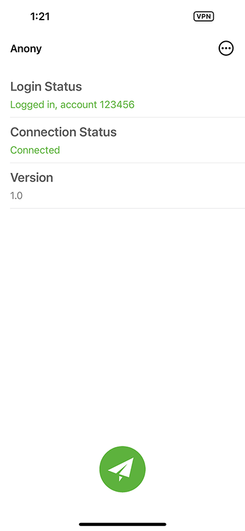
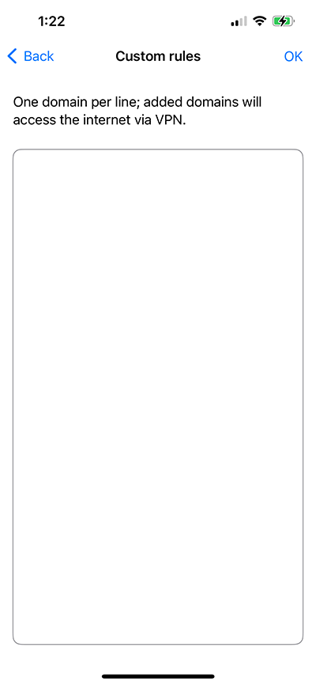

# Anony Tech Support

---

## Introduction

Anony is your ultimate tool for a secure and private internet experience. Designed with cutting-edge technology, Anony ensures that your online activities remain confidential and protected. 

**Advanced Encryption**

Anony employs state-of-the-art encryption protocols to safeguard your data during transmission. Whether you're browsing, streaming, or downloading, your information remains secure from prying eyes.

**Ad Blocking**

Tired of annoying ads interrupting your online experience? Anony comes with a powerful ad-blocking feature that removes intrusive ads, pop-ups, and trackers, ensuring a clean and uninterrupted browsing experience.

**Privacy Protection**

Your privacy is our priority. Anony hides your IP address and encrypts your internet connection, making it impossible for third parties to monitor or track your online activities. Browse the web with complete anonymity and peace of mind.

**No-Logs Policy**

We believe in your right to privacy. Anony adheres to a strict no-logs policy, meaning we do not track, store, or share your online activities. What you do online is your business, and we keep it that way.

**High-Speed Servers***

Enjoy fast and stable connections with our network of high-speed servers located around the globe. Whether you're accessing content, streaming videos, or gaming, experience the internet without buffering or lag.

**Easy-to-Use Interface**

Anony is designed for everyone. With a user-friendly interface, you can connect to a secure server with just one tap. No technical knowledge required.

----

## Usage

---

## Getting Support:

mail to: [anony@gmail.com](mailto:anony@gmail.com)