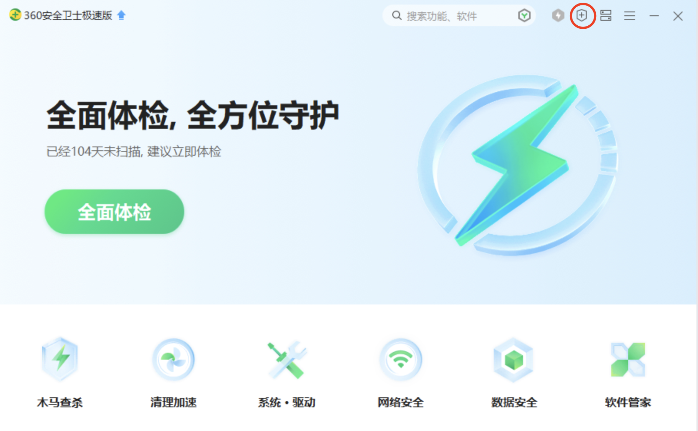
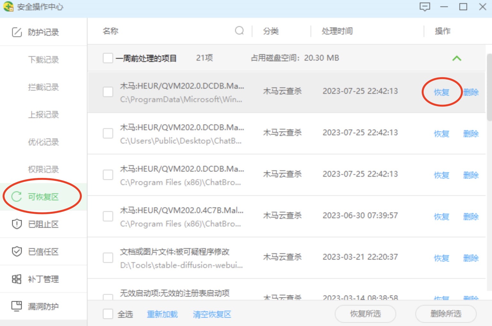
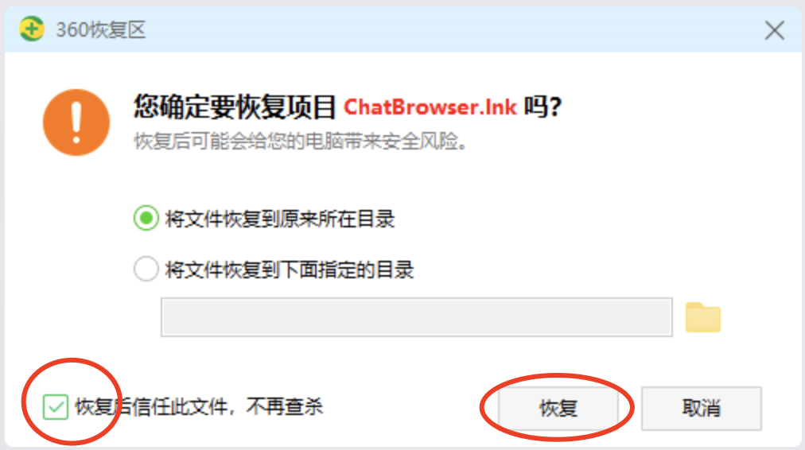
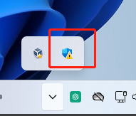
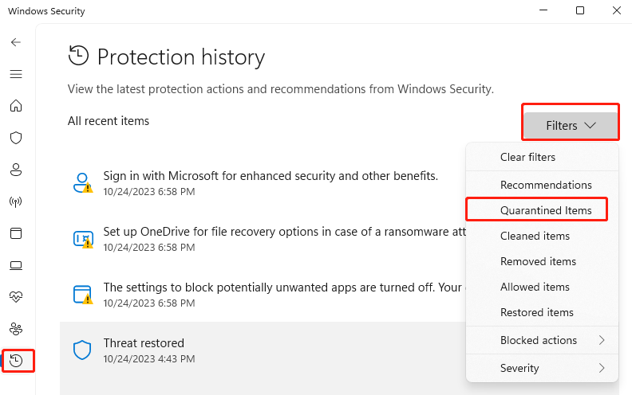

# 杀毒误报解决方法
←从左边侧边栏选择你的杀毒软件

## 360添加信任

1. 点主界面右上角的盾版

---
## Windows 安全中心

如果被windows 内置的杀毒误杀，可以选择从隔离区恢复，或添加排除项。**两个操作二选一**

### 方法一：隔离恢复

#### 1. 进入windows 安全中心（windows security）

#### 2. 打开”保护历史记录“（protection history）

#### 3. 筛选 **已隔离的项目**
#### 4. 选择要保留的项目，然后选择**还原**

---

### 方法２：添加排除项

#### 1. 进入windows 安全中心（windows security）

#### 2. 病毒和威胁防护设置->管理设置

#### 3. 往下拉->“**排除项**”下选择“**添加或删除排除项**”。

#### 4. 选择“**添加排除项**”，然后选择ChatBrowser安装路径

####  5. 操作完可能需要重新安装ChatBrowser

